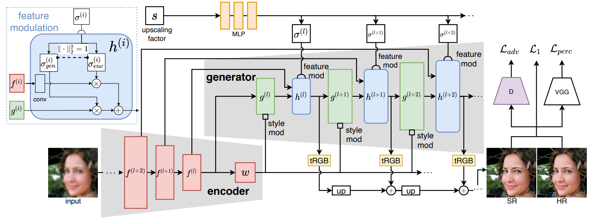
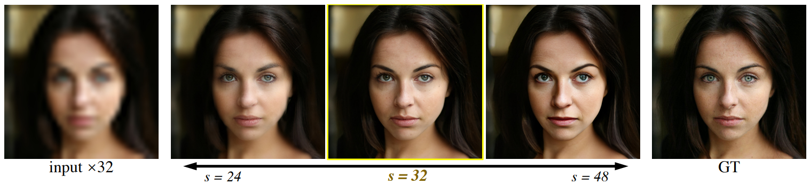

### :book: GCFSR: a Generative and Controllable Face Super Resolution Method Without Facial and GAN Priors

> [[Paper](https://arxiv.org/abs/2203.07319)] &emsp; [[Project Page](https://arxiv.org/abs/2203.07319)] &emsp; [Demo] <br>
> [Jingwen He](), [Wu Shi](), [Kai Chen](), [Lean Fu](), [Chao Dong]() <br>
Bytedance, Shenzhen Institute of Advanced Technology, Chinese Academy of Sciences, Shanghai AI Laboratory, Shanghai, China.



#### Results


---

## Dependencies and Installation

- Python >= 3.7 (Recommend to use [Anaconda](https://www.anaconda.com/download/#linux) or [Miniconda](https://docs.conda.io/en/latest/miniconda.html))
- [PyTorch >= 1.7](https://pytorch.org/)
- Option: NVIDIA GPU + [CUDA](https://developer.nvidia.com/cuda-downloads)
- Option: Linux

### Installation
1. Clone repo

    ```bash
    git clone https://github.com/hejingwenhejingwen/GCFSR
    cd GCFSR
    ```

1. Install dependent packages

    ```bash
    pip install -r requirements.txt
    python setup.py develop
    ```

## Inference

**Inference for blind face restoration**
  
```bash
python inference_gcfsr_blind.py --model_path experiments/pretrained_models/gcfsr_blind_512.pth --input inputs/sample 
```

**Inference (TODO)**
  
```bash
python inference_gcfsr.py --model_path experiments/ --scale 32 --input inputs/sample --output outputs/tmp
```


## Training

We provide the training codes for GCFSR.

**Procedures**

1. Training dataset preparation: [FFHQ](https://github.com/NVlabs/ffhq-dataset)

1. Validation dataset preparation: [CelebA-val]()
> python make_val_dataset.py --input datasets/celeba_val --output datasets/celeba_val_input

1. Modify the configuration file `options/train_gcfsr.yml` accordingly.

1. Training

> python -m torch.distributed.launch --nproc_per_node=8 --master_port=22021 basicsr/train.py -opt options/train/train_gcfsr.yml --launcher pytorch


## Model Zoo

| Model Name  | Description | 
| :---:        |     :---:      |
<!-- | [gcfsr-1024]() | 1024 model trained with L1 + perceptual loss + gan loss. |
| [gcfsr-512]() |  512 model trained with gan loss only. | -->
| [gcfsr-512-blind](https://drive.google.com/file/d/1Yzi1O5SeSFq_yrunrTJ1nkTT8jbBOaLJ/view?usp=sharing) |  blind face restoration. |

## BibTeX

    @inproceedings{he2022gcfsr,
      title={GCFSR: a Generative and Controllable Face Super Resolution Method Without Facial and GAN Priors},
      author={He, Jingwen and Shi, Wu and Chen, Kai and Fu, Lean and Dong, Chao},
      booktitle={Proceedings of the IEEE/CVF Conference on Computer Vision and Pattern Recognition},
      pages={1889--1898},
      year={2022}
    }

## :e-mail: Contact

If you have any question, please email `hejingwenhejingwen@outlook.com`.
